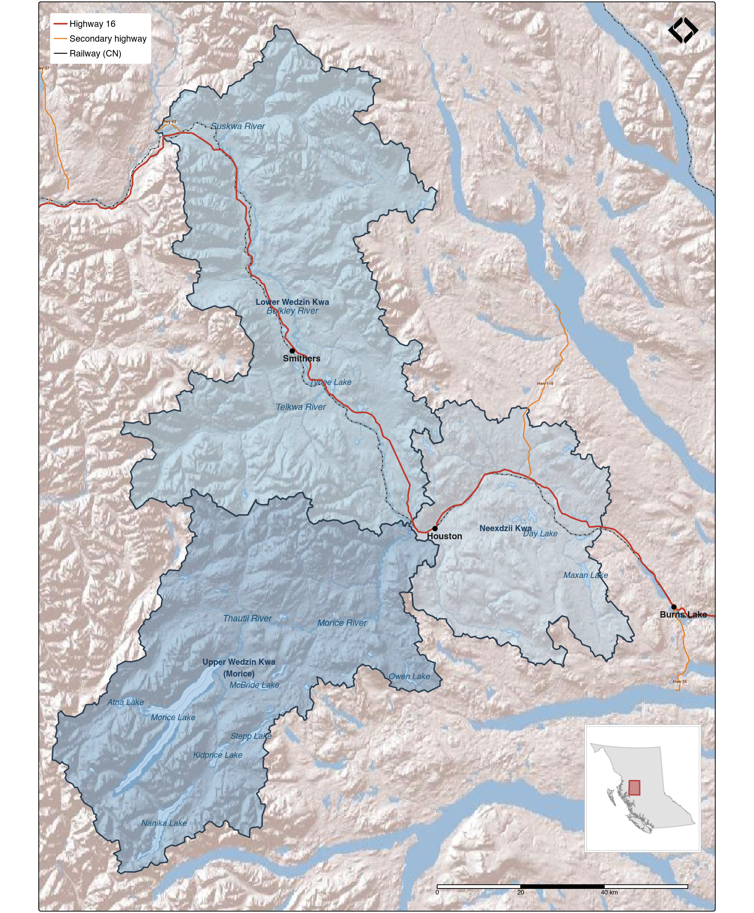

# Introduction {#intro}

```{r setup-0100-intro}
knitr::opts_chunk$set(fig.path = "fig/0100-intro/", dev = "png")
```

The Neexdzii Kwa (Upper Bulkley River) is an 8th order stream draining approximately 2,320 km^2^ of the Nechako Plateau in a generally northwesterly direction from Bulkley Lake to the confluence with the Wedzin Kwa (Morice River) near Houston (Figure \@ref(fig:map-study-area)). Highway 16 and the CN Railway parallel the river through an agricultural valley with the towns of Topley and Houston along its length. Below Houston, the combined system becomes the lower Wedzin Kwa (Bulkley River), flowing north through Smithers and Witset to the Skeena River at Hazelton. Together with the Upper Wedzin Kwa (Morice River), these three sub-regions form the Wedzin Kwa — a combined watershed of approximately 7,800 km^2^ within Wet'suwet'en territory. Despite its name, the Neexdzii Kwa is a tributary to the much larger Wedzin Kwa, contributing on average less than a third of flow volumes at their confluence. Colonial naming designated "Bulkley River" as the mainstem from Houston to Hazelton; a more accurate colonial name for the system would have been the Morice River, with the Upper Bulkley considered a tributary. Using Wet'suwet'en place names communicates a more accurate interpretation of the geography.

<br>

Benthic invertebrate communities are widely used as indicators of stream ecosystem health because they integrate water quality conditions over time, reflect habitat integrity, and respond predictably to disturbance [@rosenberg_resh1993Introductionfreshwater; @reynoldson_etal1997referencecondition]. The Canadian Aquatic Biomonitoring Network (CABIN) protocol provides a standardized framework for sampling and assessing benthic communities across Canada [@environmentcanada2012Canadianaquatic].

<br>

This report presents a benthic invertebrate community assessment of three mainstem sites on the Neexdzii Kwa, sampled in triplicate during the 2025 field season. Analysis includes community composition, diversity metrics, functional feeding group analysis, and multivariate ordination to characterize aquatic ecosystem health and detect differences among sites. This work is a companion to the [Neexdzii Kwa restoration planning report](https://www.newgraphenvironment.com/restoration_wedzin_kwa_2024/) [@irvine_schick2026NeexdziiKwah], which summarizes key findings from this assessment in the context of broader watershed restoration objectives. The assessment was undertaken to fill a data gap identified during the restoration planning research, which found limited recent characterization of benthic community condition on the Neexdzii Kwa mainstem.


```{r map-study-area, fig.cap = "Study area — the Neexdzii Kwa (Upper Bulkley River) within the broader Wedzin Kwa (Bulkley-Morice) watershed in northwestern British Columbia.", eval = TRUE, echo = FALSE}

```

