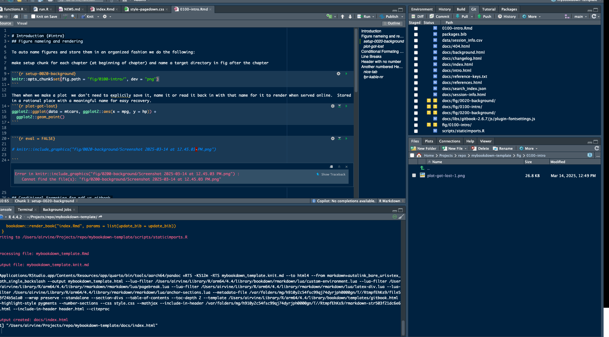

# Introduction {#intro}
## Figure nameing and rendering

To auto name figures and store them in an organized fashion we do the following

  - make setup chunk for each chapter (at beginning of chapter)  
  - name a target directory in fig after the chapter

```{r setup-0020-background}
knitr::opts_chunk$set(fig.path = "fig/0100-intro/", dev = "png")
```

Then when we make a plot  (Figure \@ref(fig:plot-got-lost))  we don't need to explicitly save it, name it or read it back in with that name for it to render when served online.  Stored in a rational place with a meaningful name for easy recovery. Another gotcha is that we need to set the caption for the plot with `fig.cap=` to have the cross referencing work.


```{r plot-got-lost, fig.cap=my_caption}

my_caption <- "Example of plot figure generated with knitr opts chunk."
ggplot2::ggplot(data = mtcars, ggplot2::aes(x = mpg, y = hp)) +
  ggplot2::geom_point()

```


```{r eval = TRUE}



```

## Conditional Formating for pdf vs gitbook 

`r if(identical(params$gitbook_on, FALSE))knitr::asis_output(paste0("This report is available as pdf and as an online interactive report at ", params$report_url, ". We recommend viewing online as the web-hosted html version contains more features and is more easily navigable."))`

`r if(identical(params$gitbook_on, FALSE)){knitr::asis_output("<br>")}`

## Line Breaks {-}
Here is an example of how to insert an empty line between paragraphs. We do it using two blank lines...

This is the paragraph that follows the empty line.

Additionally, writers should investigate the impacts of different header levels (ex. First level (#) or Second level
(##) or third (###)) as well as before and after figures/tables on spacing before and after the headers so we produce as
professional looking documents as possible.  There are idiosyncrasies with what happens for each above and below so that
should be tested by building the documents in both formats (`html` and `pdf`) and viewing the output. Here is a test
with a second level header with no empty line above and no empty line below.
## Header with no number {-}

It negates the header... wow.

If we put blank lines above the header however...

## Another numbered Header
No spacing or `<br>` above this line.  

Here is a `knitr::kable` with a cross reference to Table \@ref(tab:nice-tab).
```{r nice-tab, eval = TRUE}
knitr::kable(
  head(iris, 10), caption = 'Here is a nice kable!',
  booktabs = TRUE
)
```
This is what happens with multiple empty lines but no `<br>` inserted directly after a figure...


```{r kable-example, eval = T}
knitr::kable(
  head(iris, 20),
  caption = 'Here is another kable example.',
  booktabs = TRUE
)
```

<br>

But if we put a `<br>` below the figure with blank lines either side of our text we are good to go.

Test.


