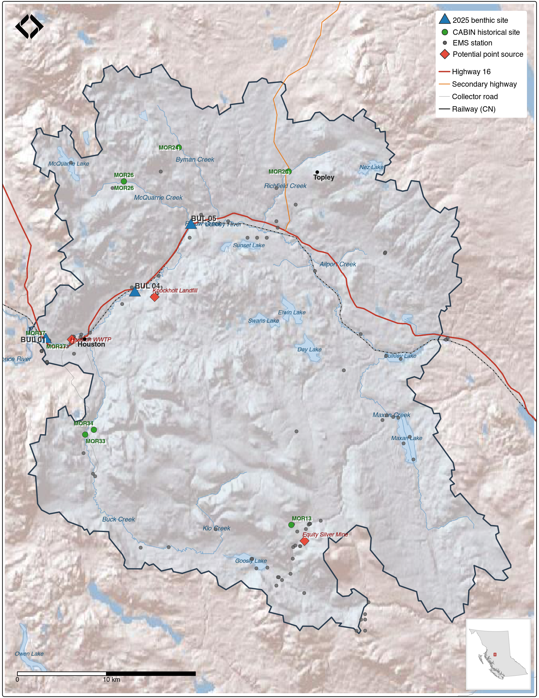

# Background

```{r setup-0200-background}
knitr::opts_chunk$set(fig.path = "fig/0200-background/", dev = "png")
```

## Wet'suwet'en Governance

The Wedzin Kwa watershed lies within the Yintah of the Wet'suwet'en people, who have governed these lands and waters through their hereditary chief system for thousands of years. The Wet'suwet'en are a matrilineal society organized into five clans — Gilseyhu (Big Frog), Laksilyu (Small Frog), Tsayu (Beaver), Gitdumden (Wolf/Bear), and Laksamshu (Fireweed) — with thirteen house groups (*yikh*) managing 38 distinct territories. Inuk Nu'at'en (Wet'suwet'en law) governing the harvesting of fish and management of the Yintahk (Land) are founded on values developed over thousands of years of social, subsistence, and environmental dynamics [@officeofthewetsuweten2013WetsuwetenTitle; @morin2016NiwhtsideniHibiiten]. The Delgamuukw-Gisday'wa Supreme Court decision (1997) affirmed that Wet'suwet'en Aboriginal title had not been extinguished, and the Office of the Wet'suwet'en continues to assert governance over watershed management and fisheries within their territories [@harris2011Yinkadinii].

## Land Use and Water Quality

The Neexdzii Kwa has experienced intensive land-use transformation including agriculture, forestry, and linear infrastructure development, and has been noted as containing some of the most intense land use in the Skeena Basin [@gottesfeld_rabnett2007SkeenaFish]. Water quality concerns centre on nutrient enrichment, point-source contamination, legacy mine drainage, and thermal stress. @remington_donas2000Nutrientsalgae found that the watershed's glacial-fluvial and glacial-lacustrine soils have unusually high soluble phosphorus concentrations relative to other Skeena streams, making the system vulnerable to eutrophication from nitrogen loading linked to agriculture, septic systems, and livestock. Periphyton biomass near Houston averaged 145 mg/m² chlorophyll-*a* (1996–1999), with increasing filamentous green algae indicative of nutrient enrichment. @nijman1996Waterquality established water quality objectives for the Bulkley River headwaters in the context of acid mine drainage from the Equity Silver Mine, where ongoing lime treatment of waste rock is expected to be required for over 100 years. More recent monitoring confirmed that water temperature and dissolved oxygen remain the parameters most frequently exceeding BC Water Quality Guidelines, while total phosphorus was notably absent from the 2017 sampling program [@oliver2020Analysis2017]. A six-year continuous temperature monitoring program documented mainstem temperatures exceeding optimal thresholds for chinook and sockeye salmon [@westcott2022UpperBulkleya].

<br>

Potential point sources of nutrient and contaminant loading include the Houston wastewater treatment plant and the Knockholt Landfill. A spatial query of BC Environmental Monitoring System (EMS) stations within the watershed boundary identified over 100 stations with historical records spanning 1972–2024 (Appendix \@ref(historical-water-quality-ems)). @remington_donas2000Nutrientsalgae recommended a long-term monitoring strategy incorporating water quality, periphyton, and benthic invertebrate bioassessment — the present study represents the first systematic benthic assessment of the Neexdzii Kwa mainstem, addressing that recommendation 25 years later.

## Previous Benthic Monitoring

Benthic invertebrate bioassessment in the Skeena basin has been conducted within the CABIN Reference Condition Approach (RCA) framework. @perrin_etal2007Bioassessmentstreams established the original Skeena RCA model using 86 reference sites and 170 test sites across north-central BC, and @bennett2011revisedpredictive revised the model with an expanded dataset of 145 reference sites classified into four groups using six landscape-level predictor variables (percent ice, January precipitation, percent wetlands, percent intrusive rock, January snowfall, and percent lakes). The revised model achieved 77% classification accuracy and has been applied by the BC Ministry of Environment Skeena Region for impact assessment near landfills, agriculture, mining, and other anthropogenic activities.

<br>

Nine CABIN sites have been sampled within the Neexdzii Kwa watershed, all under the "BC MOE-FSP Skeena Region" and "BC-Wet'suwet'en ESI" studies (Table \@ref(tab:cabin-sites-cap); Figure \@ref(fig:map-benthic-sites)). Most sites are on tributaries and were sampled once in 2004. Of particular relevance, MOR37 ("Upper Bulkley @ Morice") is located on the Neexdzii Kwa mainstem at approximately the same location as our 2025 site BUL-01 — sampled in 2004 and again in 2018 under the Wet'suwet'en Environmental Stewardship Initiative, providing two historical benthic datasets for temporal comparison with the present study. CABIN data were obtained from the [ECCC Open Government Portal](https://open.canada.ca/data/en/dataset/13564ca4-e330-40a5-9521-bfb1be767147).

<br>

```{r cabin-sites-cap, results="asis"}
my_caption <<- "CABIN benthic monitoring sites within the Neexdzii Kwa watershed. Sites were identified by spatial intersection of all Pacific drainage (MDA 08) CABIN study locations with the watershed boundary. MOR37 corresponds to the 2025 BUL-01 sampling location."
my_tab_caption(tip_flag = FALSE)
```

```{r cabin-sites}
readr::read_csv("data/processed/cabin_opendata_sites_neexdzii.csv",
                show_col_types = FALSE) |>
  dplyr::select(
    Site,
    `Site Name` = SiteName,
    `Stream Order` = stream_order,
    Visits = n_visits,
    Years = years,
    Study = studies
  ) |>
  my_dt_table(cols_freeze_left = 2, page_length = 10)
```

<br>

```{r map-benthic-sites, fig.cap='Sampling and monitoring locations within the Neexdzii Kwa watershed. Blue triangles indicate 2025 benthic sampling sites; green circles show CABIN historical sites (Table \\@ref(tab:cabin-sites-cap)); red diamonds mark potential point sources. Grey dots are EMS water quality stations — see Appendix \\@ref(historical-water-quality-ems) for interactive detail.', out.width="100%"}

```

