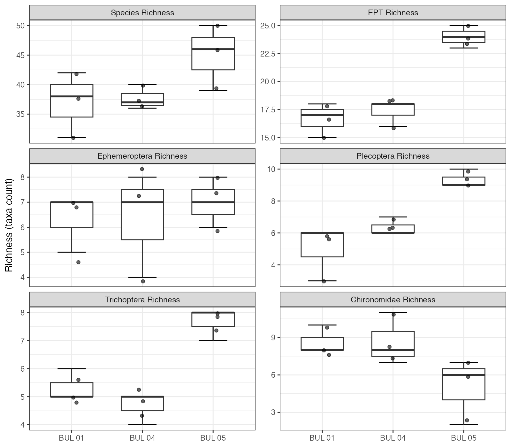
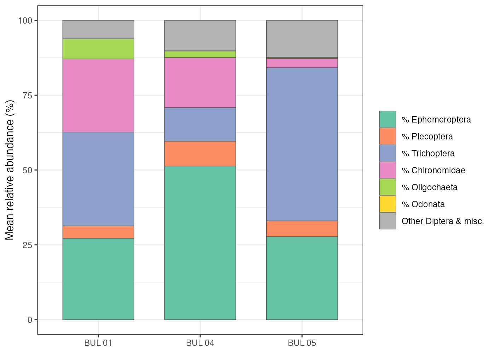
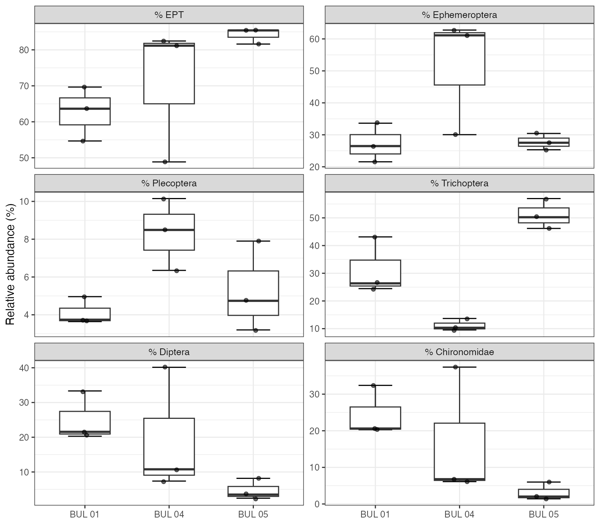
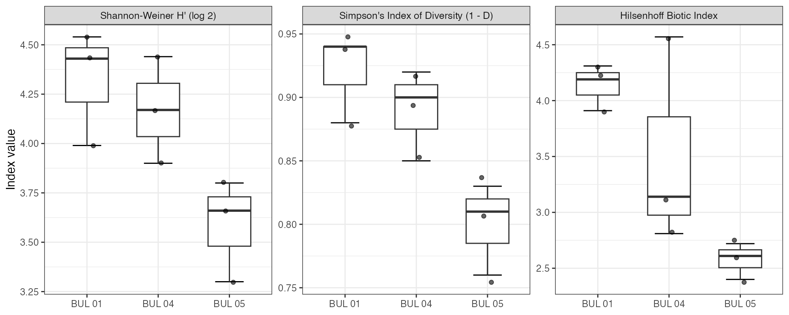

# (PART) Results {-}

# Historical Water Quality

```{r setup-0400-results}
knitr::opts_chunk$set(fig.path = "fig/0400-results/", dev = "png")
```

Historical water quality data from BC's Environmental Monitoring System (EMS) were compiled for stations within the Neexdzii Kwa watershed to characterize baseline nutrient conditions and identify point-source influences relevant to benthic community health. Full station details, time series, and boxplots are presented in Appendix \@ref(historical-water-quality-ems).

<br>

Total phosphorus exceeded the CCME Canadian Guidance Framework trigger value (10 µg/L) at the majority of stations and sampling events across the watershed, consistent with the naturally high soluble phosphorus concentrations in glacial-fluvial soils noted by @remington_donas2000Nutrientsalgae. Median TP concentrations at mainstem stations ranged from 16.5 µg/L upstream of Houston to 51 µg/L at the downstream sewage monitoring station, with the Houston STP reach showing elevated concentrations at both upstream and downstream stations. Nitrogen species (nitrate+nitrite, ammonia, TKN) were consistently well below BC Water Quality Guidelines across all station groups — maximum nitrate+nitrite concentration across all 862 samples was 0.18 mg/L, far below the 3 mg/L aquatic life guideline. Ammonia concentrations at the three Houston STP stations did not exceed sample-specific BC Water Quality Guidelines calculated from concurrent pH and temperature measurements.

<br>

At the Knockholt Landfill, paired upstream/downstream sampling (2004–2006) showed no detectable nutrient enrichment, though the small sample size (n = 3 per station) limits inference. Buck Creek stations had limited nutrient data (1–2 TP samples each), all above the CCME trigger, but insufficient temporal coverage to assess trends. General water quality parameters (pH, dissolved oxygen, conductivity) at mainstem stations were within normal ranges, with pH consistently between the BC WQG bounds of 6.5–9.0.

<br>

These results confirm that the Neexdzii Kwa is a phosphorus-enriched system where background TP concentrations routinely exceed the CCME eutrophication trigger. The Houston STP contributes additional phosphorus loading, but upstream concentrations are already elevated, underscoring the landscape-level nutrient sources identified by @remington_donas2000Nutrientsalgae — glacial-fluvial and glacial-lacustrine soils with naturally high soluble phosphorus, compounded by agricultural runoff, septic inputs, and livestock access. This nutrient context is relevant to interpreting benthic community composition, particularly the prevalence of nutrient-tolerant taxa.

# Community Composition and Diversity

The species that live on the streambed reflect the conditions they experience — different insects tolerate different levels of pollution, temperature, and habitat quality. By examining which taxa are present, how abundant they are, and how they feed, we can read the biological signal of stream health at each site. The following sections break this down by taxonomic composition, functional feeding groups, and tolerance-weighted indices, building a multi-metric picture of condition across the three Neexdzii Kwa mainstem sites.

```{r metrics-load}
metrics <- readr::read_csv("data/processed/metrics_long.csv", show_col_types = FALSE)

# Helper: site-level mean ± SD for a given metric
metric_summary <- function(m) {
  metrics |>
    dplyr::filter(metric == m) |>
    dplyr::group_by(site) |>
    dplyr::summarise(
      mean = round(mean(value), 1),
      sd = round(sd(value), 1),
      .groups = "drop"
    )
}
```

## Taxonomic Richness and Abundance

The number of distinct taxa at a site reflects habitat diversity and water quality — sites with more species can support both common and sensitive organisms. EPT taxa (mayflies, stoneflies, and caddisflies) are particularly informative because most require clean, well-oxygenated water to survive.

<br>

A total of 67 taxa were identified across the nine samples, with richness increasing along an upstream gradient from a mean of 37 taxa at BUL-01 to 45 taxa at BUL-05 (Figure \@ref(fig:plot-richness)). EPT (Ephemeroptera, Plecoptera, Trichoptera) richness followed a similar pattern, averaging 17 taxa at BUL-01 and BUL-04 but rising to 24 at BUL-05. Plecoptera and Trichoptera richness drove this difference — BUL-05 averaged 9.3 and 7.7 taxa, respectively, compared to 5.0 and 5.3 at BUL-01.

<br>

Total corrected abundance (extrapolated from subsample) was highest at BUL-05 (mean 20,560 individuals per kick-net sample), roughly double the abundance at BUL-01 (mean 9,973) and BUL-04 (mean 7,020). This difference was driven largely by the dominance of *Lepidostoma* (Trichoptera: Lepidostomatidae) at BUL-05, which alone comprised 42% of total abundance at that site.

<br>

```{r plot-richness-cap, results="asis"}
my_caption <<- "Taxonomic richness by site for total taxa, EPT, and individual EPT orders. Individual points represent replicate kick-net samples (n = 3 per site)."
my_tab_caption(tip_flag = FALSE)
```

```{r plot-richness, fig.cap=my_caption, fig.width=8, fig.height=7}

```

## Community Composition

Beyond counting species, the relative proportions of different groups tell us about site condition. A healthy stream community is typically dominated by EPT — sensitive insects that need clean water. When pollution-tolerant groups like Chironomidae (midges) and Oligochaeta (worms) start making up a larger share of the community, it signals nutrient enrichment or organic loading.

<br>

Community composition showed a clear gradient across the three sites (Figure \@ref(fig:plot-community-stacked)). EPT relative abundance increased from 63% at BUL-01 to 84% at BUL-05, while Chironomidae decreased from 24% to 3% and Oligochaeta from 7% to <1%. This pattern is consistent with established bioassessment frameworks, in which increasing Chironomidae and Oligochaeta dominance indicates organic enrichment, while high EPT proportions are characteristic of healthy stream communities [@barbour_etal1999Rapidbioassessment; @rosenberg_resh1993Introductionfreshwater].

<br>

Although Trichoptera were well-represented at both BUL-01 (31% of individuals) and BUL-05 (51%), the composition of this order differed markedly between sites. At BUL-01, Trichoptera were dominated by the net-spinning caddisflies *Hydropsyche* (20% of total abundance) and *Cheumatopsyche* (7%) — both Hydropsychidae, a family whose increasing relative abundance within Trichoptera is indicative of organic enrichment [@barbour_etal1999Rapidbioassessment]. At BUL-05, Trichoptera were instead dominated by *Lepidostoma* (Lepidostomatidae), a shredder that feeds on allochthonous leaf litter and is associated with intact riparian function and good water quality.

<br>

BUL-04 was intermediate in composition but showed high within-site variability, particularly in Chironomidae (6–37% across replicates) and Ephemeroptera (30–63%; Figure \@ref(fig:plot-community-pct)), suggesting fine-scale habitat heterogeneity at that site.

<br>

```{r plot-community-stacked-cap, results="asis"}
my_caption <<- "Mean relative abundance of major taxonomic groups across the three sampling sites. Proportions are averaged across three replicate kick-net samples per site."
my_tab_caption(tip_flag = FALSE)
```

```{r plot-community-stacked, fig.cap=my_caption, fig.width=7, fig.height=5}

```

<br>

```{r plot-community-pct-cap, results="asis"}
my_caption <<- "Relative abundance of major taxonomic groups by site, showing individual replicate values. EPT orders (Ephemeroptera, Plecoptera, Trichoptera), Diptera, and Chironomidae are shown separately to highlight the shift from Chironomidae-enriched communities at BUL-01 to EPT-dominated communities at BUL-05."
my_tab_caption(tip_flag = FALSE)
```

```{r plot-community-pct, fig.cap=my_caption, fig.width=8, fig.height=7}

```

## Functional Feeding Groups

Invertebrates can also be grouped by how they feed — scrapers graze algae off rocks, shredders break down leaves, collectors filter or gather fine particles from the water. The balance of these feeding strategies reflects what food sources are available and how the stream ecosystem is functioning. Sites with diverse feeding groups, especially shredders and scrapers, typically have intact riparian zones and clean substrates, while communities dominated by generalist collectors often indicate enriched conditions.

```{r ffg-compute}
# Compute FFG proportions from tidy counts (more reliable than Cordillera metrics sheet)
counts <- readr::read_csv("data/processed/benthic_counts_tidy.csv", show_col_types = FALSE)

ffg_site <- counts |>
  dplyr::mutate(
    corrected = count * (100 / pct_sampled),
    ffg_clean = dplyr::if_else(is.na(ffg), "Unclassified", ffg)
  ) |>
  dplyr::group_by(site, replicate, ffg_clean) |>
  dplyr::summarise(abundance = sum(corrected), .groups = "drop") |>
  dplyr::group_by(site, replicate) |>
  dplyr::mutate(pct = abundance / sum(abundance) * 100) |>
  dplyr::ungroup()

ffg_means <- ffg_site |>
  dplyr::group_by(site, ffg_clean) |>
  dplyr::summarise(pct = mean(pct), .groups = "drop")

# Order FFGs by overall mean abundance
ffg_order <- ffg_means |>
  dplyr::group_by(ffg_clean) |>
  dplyr::summarise(total = sum(pct), .groups = "drop") |>
  dplyr::arrange(dplyr::desc(total)) |>
  dplyr::pull(ffg_clean)

ffg_palette <- c(
  "Collector-Gatherer"   = "#66c2a5",
  "Collector-Filterer"   = "#fc8d62",
  "Shredder-Herbivore"   = "#a6d854",
  "Predator"             = "#e78ac3",
  "Scraper"              = "#8da0cb",
  "Omnivore"             = "#e5c494",
  "Piercer-Herbivore"    = "#1b9e77",
  "Macrophyte-Herbivore" = "#ffd92f",
  "Unclassified"         = "#999999"
)
```

Functional feeding group (FFG) composition reflected the taxonomic gradient, with distinct trophic structures at each site (Figure \@ref(fig:plot-ffg-stacked)). Collector-gatherers dominated BUL-01 (49%) and BUL-04 (61%), while collector-filterers were most abundant at BUL-01 (31%) — driven almost entirely by Hydropsychidae. At BUL-05, shredder-herbivores comprised 42% of individuals (*Lepidostoma*), with predators (15%) and scrapers (13%) also well-represented.

<br>

The high proportion of specialized feeders (shredders, scrapers) at BUL-05 is consistent with healthy stream function (Figure \@ref(fig:plot-ffg-box)). Shredders and scrapers are among the most sensitive functional groups and are associated with intact riparian zones and clean substrates, whereas communities dominated by generalist collectors and filterers indicate greater tolerance to disturbance [@barbour_etal1999Rapidbioassessment]. The elevated collector-filterer abundance at BUL-01 is notable — Hydropsychidae filter fine particulate organic matter and suspended material, and their abundance in nutrient-enriched reaches likely reflects increased food supply from elevated primary productivity and organic inputs associated with the Houston wastewater treatment plant and surrounding agricultural land use.

<br>

```{r plot-ffg-stacked-cap, results="asis"}
my_caption <<- "Mean functional feeding group composition across the three sampling sites. Proportions computed from corrected abundances in the tidy counts dataset."
my_tab_caption(tip_flag = FALSE)
```

```{r plot-ffg-stacked, fig.cap=my_caption, fig.width=8, fig.height=5}
ggplot2::ggplot(
  ffg_means |> dplyr::mutate(ffg_clean = factor(ffg_clean, levels = rev(ffg_order))),
  ggplot2::aes(x = site, y = pct, fill = ffg_clean)
) +
  ggplot2::geom_col(position = "stack", width = 0.7, colour = "grey30", linewidth = 0.2) +
  ggplot2::scale_fill_manual(values = ffg_palette) +
  ggplot2::guides(fill = ggplot2::guide_legend(reverse = TRUE)) +
  ggplot2::theme_bw(base_size = 11) +
  ggplot2::theme(axis.title.x = ggplot2::element_blank(), legend.title = ggplot2::element_blank()) +
  ggplot2::labs(y = "Mean relative abundance (%)")
```

<br>

```{r plot-ffg-box-cap, results="asis"}
my_caption <<- "Relative abundance of major functional feeding groups by site, showing individual replicate values."
my_tab_caption(tip_flag = FALSE)
```

```{r plot-ffg-box, fig.cap=my_caption, fig.width=9, fig.height=5}
ffg_major <- c("Collector-Gatherer", "Collector-Filterer", "Shredder-Herbivore",
               "Predator", "Scraper")

ggplot2::ggplot(
  ffg_site |>
    dplyr::filter(ffg_clean %in% ffg_major) |>
    dplyr::mutate(ffg_clean = factor(ffg_clean, levels = ffg_major)),
  ggplot2::aes(x = site, y = pct)
) +
  ggplot2::stat_boxplot(geom = "errorbar", width = 0.4) +
  ggplot2::geom_boxplot(width = 0.6, outlier.shape = NA) +
  ggplot2::geom_jitter(width = 0.1, size = 1.5, alpha = 0.6) +
  ggplot2::facet_wrap(~ ffg_clean, ncol = 3, scales = "free_y") +
  ggplot2::theme_bw(base_size = 11) +
  ggplot2::theme(axis.title.x = ggplot2::element_blank(),
                 strip.text = ggplot2::element_text(size = 9)) +
  ggplot2::labs(y = "Relative abundance (%)")
```

## Diversity Indices and Biotic Index

Diversity indices summarize community complexity in a single number — how many species are present and how evenly individuals are distributed among them. The Hilsenhoff Biotic Index (HBI) takes a different approach: each species is assigned a pollution tolerance score, and the community-weighted average produces an overall water quality rating. Together, these metrics complement the compositional patterns above with standardized, comparable scores.

<br>

Shannon diversity (*H'*, log~2~) was moderately high across all sites, ranging from a site mean of 3.59 at BUL-05 to 4.32 at BUL-01 (Figure \@ref(fig:plot-diversity)). Simpson's diversity (1 − *D*) followed the same pattern, with BUL-01 (0.92) slightly exceeding BUL-05 (0.80). The higher diversity at BUL-01 despite its lower taxonomic richness reflects greater evenness in the distribution of individuals across taxa — no single taxon comprised more than 20% of the community. At BUL-05, *Lepidostoma* alone accounted for 42% of total abundance, depressing evenness-weighted diversity indices despite having the highest species richness.

<br>

This pattern — higher diversity indices at the more disturbed site — illustrates the limitation of diversity metrics as standalone indicators of ecological condition. A community with many moderately tolerant taxa distributed evenly can yield high diversity values while still reflecting impaired conditions. For this reason, composition-based metrics (% EPT, % Chironomidae) and tolerance-weighted indices (HBI) are more informative for bioassessment [@barbour_etal1999Rapidbioassessment].

<br>

The Hilsenhoff Biotic Index (HBI) showed a consistent site gradient: BUL-01 mean 4.14 (range 3.91–4.31 across replicates; "very good — possible slight organic pollution"), BUL-04 mean 3.51 (range 2.81–4.57; Excellent / Very good / Good categories all spanned), and BUL-05 mean 2.58 (range 2.40–2.72; "excellent", no apparent organic pollution) (Table \@ref(tab:tab-hbi-interp-cap)). BUL-04's wide within-site range is informative rather than problematic — it is consistent with the patchy, heterogeneous community signal already reported for this site and reinforces the transitional-zone interpretation. The overall downstream-to-upstream improvement is consistent with the nutrient gradient documented by historical water quality monitoring and with the community composition patterns described above. HBI is one of several tolerance-weighted indices used in freshwater bioassessment; the thresholds cited here follow Hilsenhoff (1987; as cited in @barbour_etal1999Rapidbioassessment), and the signal at each site is corroborated by the independent compositional metrics (% EPT, % Chironomidae, *Hydropsyche* dominance, % shredders) rather than resting on HBI alone.

<br>

```{r plot-diversity-cap, results="asis"}
my_caption <<- "Shannon diversity (H', log~2~), Simpson's diversity (1 - D), and Hilsenhoff Biotic Index by site. Lower HBI values indicate better water quality."
my_tab_caption(tip_flag = FALSE)
```

```{r plot-diversity, fig.cap=my_caption, fig.width=10, fig.height=4}

```

<br>

```{r tab-hbi-interp-cap, results="asis"}
my_caption <<- "Hilsenhoff Biotic Index (HBI) interpretation by site. HBI values and water quality ratings follow Hilsenhoff (1987; as cited in @barbour_etal1999Rapidbioassessment)."
my_tab_caption(tip_flag = FALSE)
```

```{r tab-hbi-interp}
metrics |>
  dplyr::filter(metric == "Hilsenhoff Biotic Index") |>
  dplyr::group_by(site) |>
  dplyr::summarise(
    `Mean HBI` = round(mean(value), 2),
    `Range` = paste0(round(min(value), 2), " – ", round(max(value), 2)),
    .groups = "drop"
  ) |>
  dplyr::mutate(
    `Water Quality` = dplyr::case_when(
      `Mean HBI` <= 3.50 ~ "Excellent — no apparent organic pollution",
      `Mean HBI` <= 4.50 ~ "Very good — possible slight organic pollution",
      `Mean HBI` <= 5.50 ~ "Good — some organic pollution probable",
      `Mean HBI` <= 6.50 ~ "Fair — fairly significant organic pollution",
      TRUE ~ "Poor — significant organic pollution"
    )
  ) |>
  dplyr::rename(Site = site) |>
  my_dt_table(page_length = 5, cols_freeze_left = 0)
```

