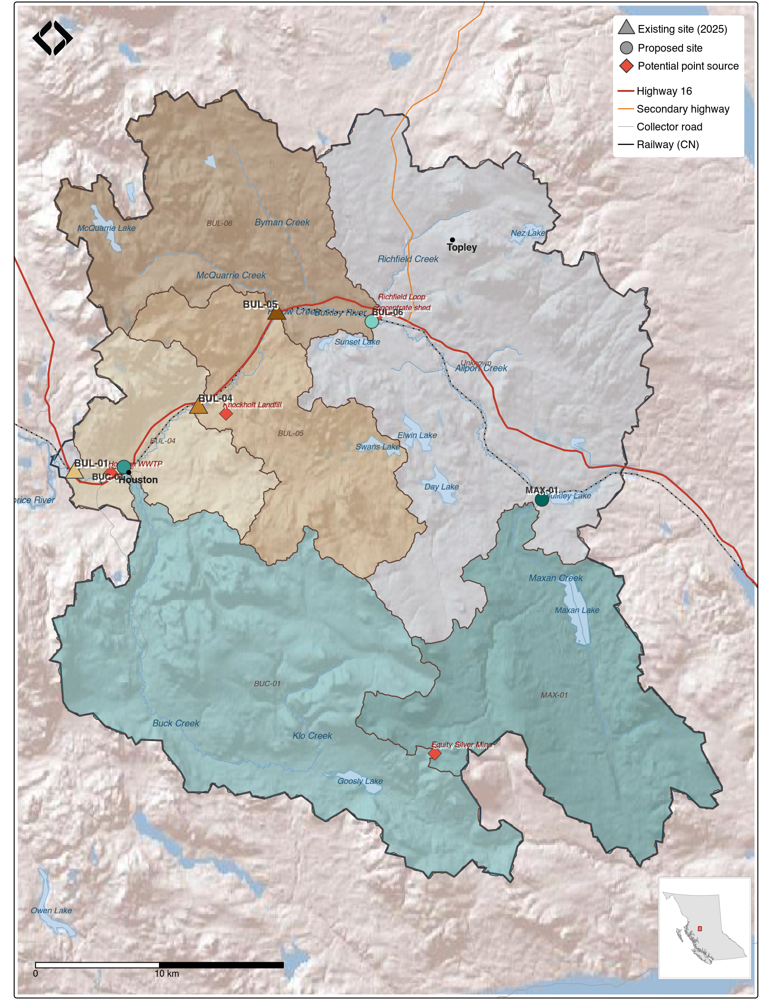

# Discussion and Recommendations

```{r setup-0600-discussion}
knitr::opts_chunk$set(fig.path = "fig/0600-discussion/", dev = "png")
```

The results presented above paint a consistent picture: ecological condition on the Neexdzii Kwa mainstem improves from downstream to upstream, with a clear biological signal of mild nutrient enrichment near Houston that fades with distance upstream. Below, we interpret these patterns in the context of the watershed's land use and water quality history, compare with previous monitoring, and outline recommendations for ongoing stewardship.

## Site Gradient and Nutrient Enrichment

The three Neexdzii Kwa mainstem sites exhibited a consistent downstream-to-upstream gradient in benthic community condition. Multiple independent lines of evidence — taxonomic composition, functional feeding group structure, tolerance-weighted biotic indices, and multivariate ordination — converged on the same pattern: BUL-01 showed biological signatures of mild organic enrichment, BUL-04 was intermediate with high variability, and BUL-05 supported a community characteristic of excellent water quality.

<br>

At BUL-01, near the Houston wastewater treatment plant, the community was characterized by elevated Chironomidae (24%) and Oligochaeta (7%), high relative abundance of collector-filterers (31%, almost entirely Hydropsychidae), and an HBI of 4.14 indicating possible slight organic pollution. These patterns are consistent with increased nutrient loading and fine particulate organic matter availability — Hydropsychidae are net-spinning caddisflies that thrive in nutrient-enriched reaches where suspended food particles are abundant [@barbour_etal1999Rapidbioassessment]. Notably, *Hydropsyche* was the single most abundant taxon at BUL-01 (20% of total abundance), a pattern not observed at the other sites. The co-dominance of *Hydropsyche* with collector-gatherers (chironomids and ephemerellids) and the relatively low representation of sensitive specialists (shredders comprised only 2% of individuals) together suggest a community shifted toward nutrient-tolerant generalists.

<br>

This biological signal aligns with the historical water quality record. Total phosphorus at mainstem stations consistently exceeds the CCME eutrophication trigger, with elevated concentrations at the Houston STP reach. @remington_donas2000Nutrientsalgae documented periphyton biomass near Houston averaging 145 mg/m² chlorophyll-*a* with increasing filamentous green algae — exactly the conditions that would support the filter-feeding Hydropsychidae assemblage observed at BUL-01.

<br>

At BUL-05, the upstream site, the community was dominated by *Lepidostoma* (42% of abundance), a shredder-herbivore caddisfly associated with intact riparian function and allochthonous leaf litter inputs. EPT (mayflies, stoneflies, and caddisflies) relative abundance (84%), taxonomic richness (45 taxa), and the HBI (2.58, "excellent") all indicate high ecological condition. The high proportion of specialized feeders (shredders 42%, scrapers 13%) at BUL-05 contrasts sharply with the generalist-dominated community at BUL-01 — specialized feeders are considered among the most sensitive indicators of stream health [@barbour_etal1999Rapidbioassessment].

## Diversity and Dominance

Shannon diversity was higher at BUL-01 (H' = 4.32, log~2~) than at BUL-05 (H' = 3.59), despite BUL-05 having greater taxonomic richness (45 vs 37 taxa). This apparent paradox reflects the strong numerical dominance of *Lepidostoma* at BUL-05, which depressed evenness. High diversity indices at moderately impaired sites are a well-recognized limitation of diversity metrics in bioassessment — a community with many tolerant taxa distributed evenly scores higher than a species-rich community dominated by one or two sensitive taxa [@rosenberg_resh1993Introductionfreshwater]. This underscores the importance of using composition-based metrics (% EPT, % Chironomidae) and tolerance-weighted indices (HBI) alongside diversity measures when assessing ecological condition.

## Multivariate Community Separation

PERMANOVA confirmed that community composition differed significantly among sites (Table \@ref(tab:permanova-table)), with homogeneous multivariate dispersion (Table \@ref(tab:betadisper-table)) confirming that this result reflects true compositional differences rather than unequal within-site variability. The NMDS ordination (Figure \@ref(fig:nmds-plot)) visually confirmed this separation, with replicate samples clustering tightly within sites and clear separation among site centroids.

<br>

The pattern of within-site variability was itself informative. BUL-05 showed the lowest multivariate dispersion (mean distance to centroid = 0.14), reflecting a stable, uniform habitat where *Lepidostoma* dominated all three replicates similarly. BUL-01 was intermediate (0.21) — the nutrient enrichment signal (Hydropsychidae, Chironomidae) was present in all replicates but varied in relative intensity, suggesting a pervasive but non-uniform influence across the reach. BUL-04 showed the highest within-site variability (0.26), with individual replicates ranging from near-reference (high EPT, low Chironomidae) to moderately impaired composition. This pattern is characteristic of a transitional zone, where fine-scale differences in substrate, velocity, or organic matter availability among kick-net locations produce a mosaic of micro-conditions and correspondingly patchy communities. This contrasts with both ends of the gradient, where conditions are more uniform — consistently enriched at BUL-01, consistently reference-quality at BUL-05.

## Comparison with Historical CABIN Data

The CABIN open data archive contains benthic records from site MOR37 (corresponding to BUL-01) from two sampling events: 2004 (BC MOE-FSP Skeena Region study) and 2018 (BC-Wet'suwet'en ESI study). Both historical samples showed Ephemeroptera-dominated communities with high EPT relative abundance. The 2025 BUL-01 community showed a notably different structure: lower EPT, substantially higher Trichoptera (dominated by Hydropsychidae), and elevated Chironomidae.

<br>

These differences should be interpreted cautiously. Although all three sampling events were within 49 m of each other (confirming the same reach), seasonal timing varied substantially — from August 13 (2018) to September 10 (2004) to October 3 (2025) — and differences in invertebrate phenology across this window could influence community composition. The two historical samples were collected under different CABIN studies with potentially different subsampling and taxonomic resolution protocols, and each is a single unreplicated sample — limiting the strength of temporal inferences.

<br>

Despite these caveats, the 2025 community composition at BUL-01 — with its high Hydropsychidae abundance and elevated Chironomidae — is consistent with a site experiencing mild nutrient enrichment. Whether the compositional differences between years reflect a real temporal change in site condition, interannual variability, or methodological differences can only be resolved through continued standardized monitoring at this location.

## Implications for Restoration Planning

These results provide a spatially explicit benthic bioassessment of the Neexdzii Kwa mainstem and establish a baseline against which future changes can be measured. The clear site gradient — from mild enrichment at BUL-01 to excellent condition at BUL-05 — provides an empirical framework for prioritizing restoration and monitoring activities. Key implications include:

<br>

- **Point-source influence is detectable but not severe.** BUL-01 shows biological signatures of nutrient enrichment consistent with proximity to the Houston STP, but the community retains high EPT richness and the HBI indicates only "possible slight" organic pollution. This suggests the system is experiencing nutrient subsidy rather than severe impairment.
- **Upstream reaches are in excellent condition, with a caveat.** BUL-05's community structure — high richness, EPT dominance, shredder prevalence, low HBI — represents a high-quality reference condition. However, BUL-05 sits immediately downstream of the McQuarrie Creek confluence, a recognized cold-water tributary draining a relatively undeveloped watershed. The cold, clean input from McQuarrie may create locally favourable conditions at BUL-05 that are not representative of the entire upstream mainstem. Additional sampling above the McQuarrie confluence would clarify whether the excellent condition observed at BUL-05 extends further upstream or is partly a localized effect of this tributary input.
- **Within-site variability at BUL-04 warrants investigation.** The high replicate variability may reflect genuine habitat heterogeneity or could indicate the site is in a transitional zone where small differences in microhabitat produce large differences in community composition.

## Recommendations {#recommendations}

1. **Continue annual or biennial monitoring.** The three-site design established here captures the key nutrient gradient and can detect temporal changes in community condition with relatively modest sampling effort (nine kick-net samples per campaign).

2. **Establish a routine water quality monitoring program.** The biological patterns documented here point to nutrient enrichment, but the existing water quality record is sparse and inconsistent. A structured sampling program — collecting nutrient concentrations (phosphorus, nitrogen species), temperature, pH, dissolved oxygen, and conductivity at a minimum biweekly frequency with additional sampling during high and low flow events — would provide the chemical context needed to interpret benthic community condition and track changes over time. BC Water Quality Guidelines specify a minimum of five samples within 30 days to evaluate long-term chronic guideline compliance [@wlrs2024BritishColumbia], making consistent sampling effort essential.

3. **Expand the monitoring network.** The current three-site design covers the mainstem nutrient gradient between Houston and McQuarrie Creek but leaves gaps in our understanding of the broader watershed. The Equity Silver Mine straddles the drainage divide between Foxy Creek (flowing north into Maxan Creek) and Bessemer Creek (flowing south into Buck Creek) [@nijman1996Waterquality], and both drainage paths warrant monitoring. Existing and proposed monitoring sites are summarized in Table \@ref(tab:tab-proposed-sites-cap) and shown in Figure \@ref(fig:map-proposed-sites).

<br>

```{r tab-proposed-sites-cap, results="asis"}
my_caption <<- "Monitoring sites for benthic assessment of the Neexdzii Kwa watershed. Existing sites were sampled in 2025; proposed sites are designed to capture mine drainage, forestry and agricultural influences, point-source impacts, and chinook-bearing reaches."
my_tab_caption(tip_flag = FALSE)
```

```{r tab-proposed-sites}
sites_monitoring <- readr::read_csv("data/raw/sites_monitoring.csv", show_col_types = FALSE) |>
  dplyr::filter(!is.na(site_id))

sites_monitoring |>
  dplyr::mutate(reach = paste0(site_id, " \u2014 ", description)) |>
  dplyr::select(Status = status, Stream = stream, Reach = reach, Rationale = rationale) |>
  knitr::kable(booktabs = TRUE) |>
  kableExtra::kable_styling(full_width = TRUE) |>
  kableExtra::row_spec(which(sites_monitoring$status == "Existing"), background = "#f0f0f0")
```

<br>

```{r map-proposed-sites, fig.cap='Proposed monitoring sites for expanded benthic assessment of the Neexdzii Kwa watershed. Triangles indicate existing 2025 sampling sites; circles show proposed expansion sites. Monitoring site marker colors correspond to the upstream sub-watershed area from which each station receives inputs.', out.width="100%", eval=TRUE}

```

