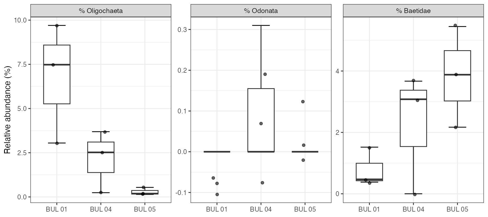
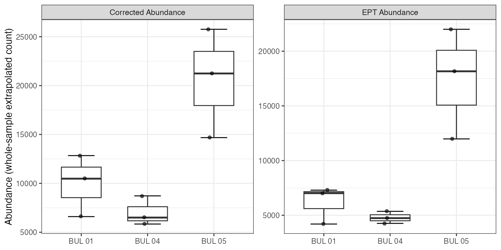
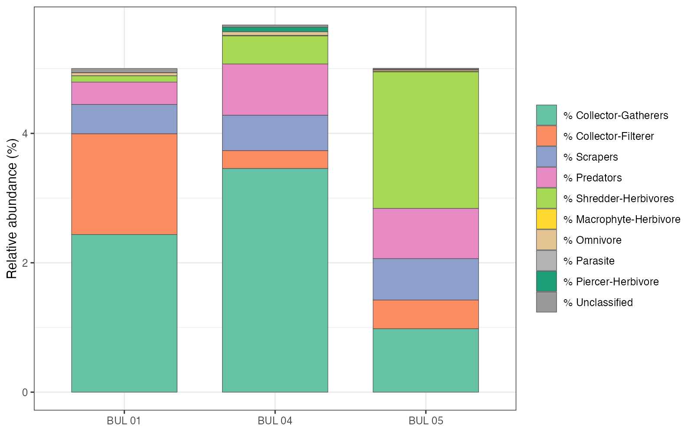
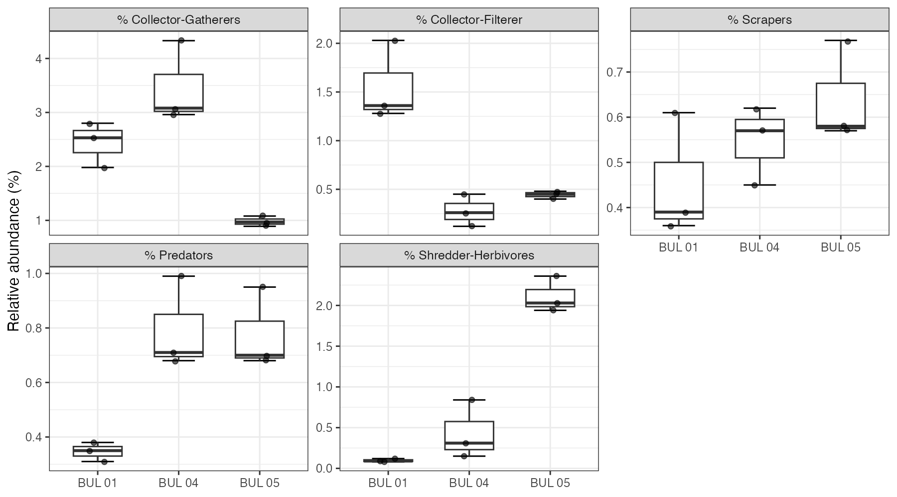
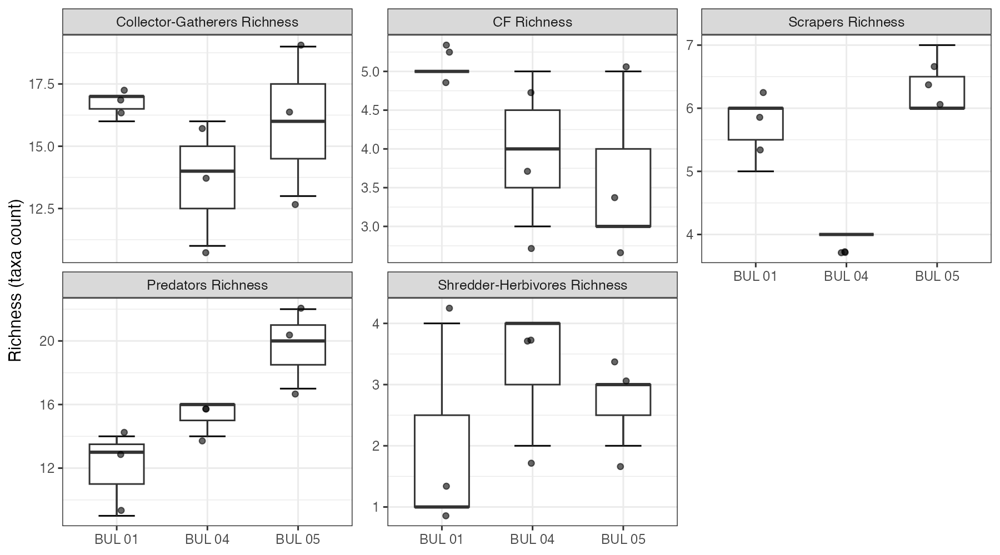
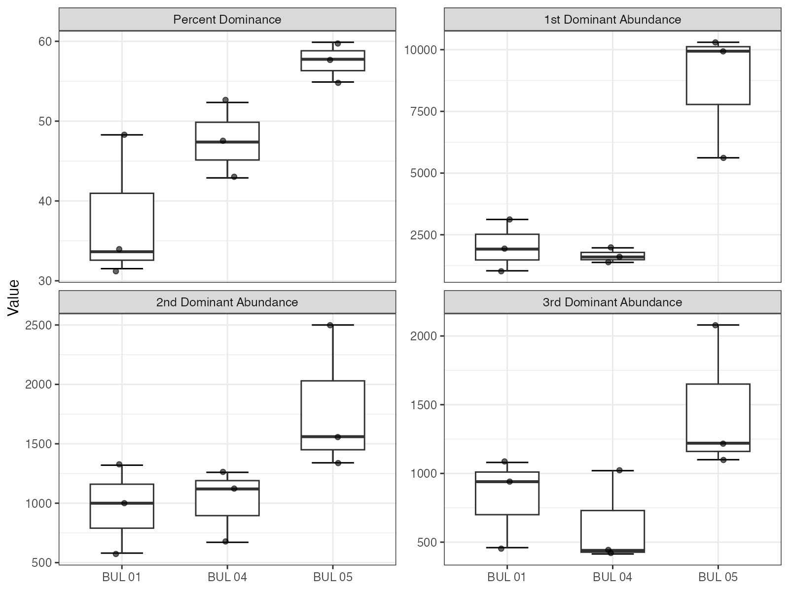
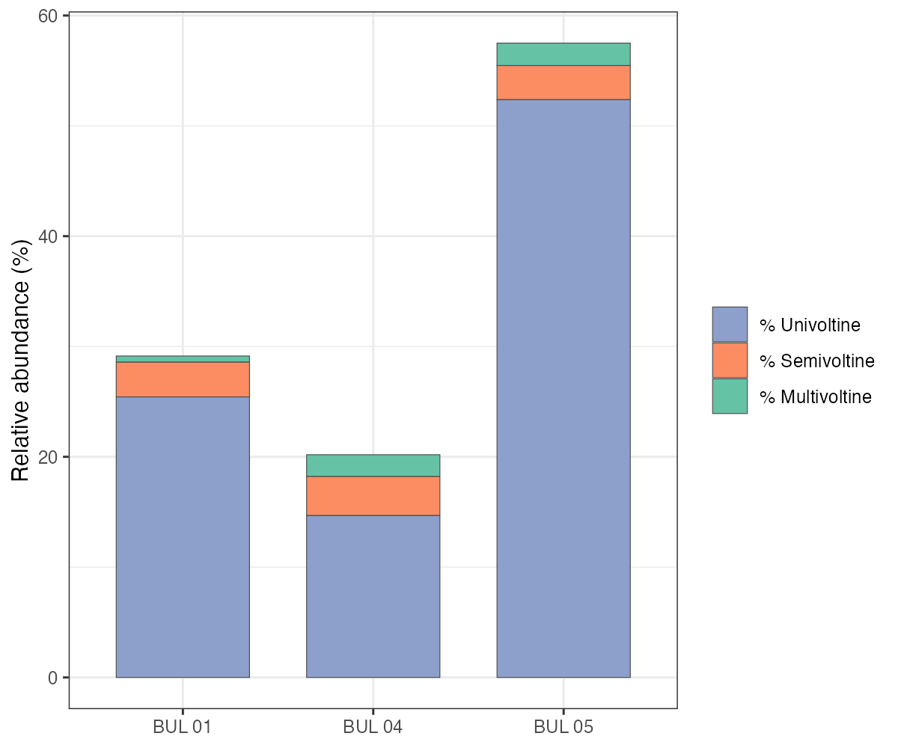
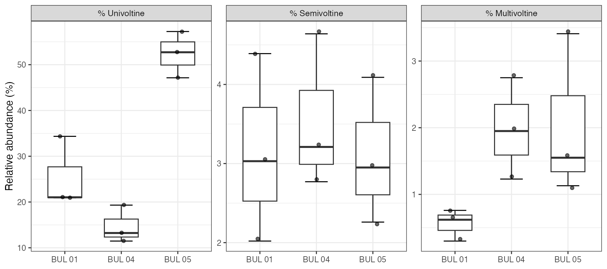

# (APPENDIX) Appendix {-}

# Exploratory Metrics Summary

```{r setup-0800-appendix-metrics}
knitr::opts_chunk$set(fig.path = "fig/0800-appendix-metrics/", dev = "png")
```

Figures below summarize benthic invertebrate community metrics calculated by Cordillera Consulting Inc. from genus-level identifications. Box-and-whisker plots show the distribution across triplicate kick samples at each site (n = 3 per site). Individual replicates are overlaid as points. Stacked bar charts show mean proportional composition averaged across replicates. All metrics are derived from whole-sample extrapolated counts.

## Richness

```{r fig-richness, fig.cap='Taxonomic richness by site. Species richness is total taxa; EPT richness counts Ephemeroptera, Plecoptera, and Trichoptera taxa only.', out.width="100%"}
knitr::include_graphics("fig/metrics/richness.png")
```

## Community Composition

```{r fig-community-stacked, fig.cap='Mean community composition by major taxonomic groups (stacked bar). Values are mean percent relative abundance averaged across triplicate kick samples at each site.', out.width="100%"}
knitr::include_graphics("fig/metrics/community_stacked.png")
```

<br>

```{r fig-community-pct, fig.cap='Community composition by major taxonomic groups (percent relative abundance). EPT represents the combined proportion of Ephemeroptera, Plecoptera, and Trichoptera.', out.width="100%"}
knitr::include_graphics("fig/metrics/community_pct.png")
```

<br>

```{r fig-community-minor, fig.cap='Minor community groups by site. Oligochaeta, Odonata, and Baetidae shown separately to highlight potential indicator taxa.', out.width="100%"}

```

## Diversity and Biotic Index

```{r fig-diversity-hbi, fig.cap='Diversity indices and Hilsenhoff Biotic Index (HBI) by site. Shannon diversity (log 2) and Simpson 1-D measure community evenness; higher values indicate more even communities. Lower HBI values indicate better water quality (0-3.5 excellent, 3.5-5.0 good, 5.0-6.5 fair).', out.width="100%"}
knitr::include_graphics("fig/metrics/diversity_hbi.png")
```

## Abundance

```{r fig-abundance, fig.cap='Total corrected abundance and EPT abundance by site. Values are extrapolated from subsample counts to estimate whole-sample density.', out.width="100%"}

```

## Functional Feeding Groups

```{r fig-ffg-stacked, fig.cap='Functional feeding group composition (stacked bar). Mean percent relative abundance averaged across replicates. Feeding groups reflect trophic relationships and energy pathways within the benthic community.', out.width="100%"}

```

<br>

```{r fig-ffg, fig.cap='Functional feeding group composition (box-and-whisker) for the five major groups by site.', out.width="100%"}

```

<br>

```{r fig-ffg-richness, fig.cap='Functional feeding group richness (taxa count) by site. CG = Collector-Gatherer, CF = Collector-Filterer.', out.width="100%"}

```

## Dominance

```{r fig-dominance, fig.cap='Percent dominance (combined relative abundance of the three most abundant taxa) and individual dominant taxon abundances by site. Higher dominance indicates a less even community structure.', out.width="100%"}

```

## Voltinism

```{r fig-voltinism-stacked, fig.cap='Voltinism composition (stacked bar). Mean percent of community classified as univoltine (one generation per year), semivoltine (less than one), or multivoltine (more than one). Semivoltine taxa are typically associated with cooler, less disturbed streams.', out.width="100%"}

```

<br>

```{r fig-voltinism, fig.cap='Voltinism categories by site (box-and-whisker). Distribution of replicate values for each voltinism class.', out.width="100%"}

```
