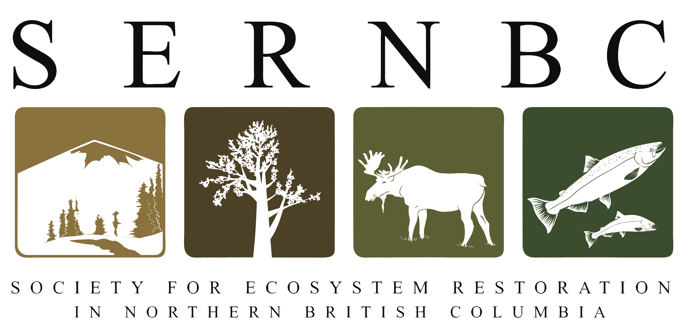

```{r exec-pdf-setup, include=FALSE}
knitr::opts_chunk$set(echo = FALSE, message = FALSE, warning = FALSE)
version <- desc::desc_get_version()
build_date <- format(Sys.Date(), "%Y-%m-%d")
```

<style>
/* Remove blank filler pages between content pages */
.pagedjs_page.pagedjs_blank_page {
  display: none !important;
}
/* Compact references: smaller text, hanging indent, spacing between entries */
#refs .csl-entry {
  font-size: 0.8em;
  padding-left: 2em;
  text-indent: -2em;
  margin-bottom: 0.5em;
}
</style>


<div style="text-align: center; margin-top: 2em; margin-bottom: 1em;">

</div>

<div style="text-align: center; font-size: 0.85em; line-height: 1.6;">

Version `r version` DRAFT | `r build_date`

</div>

<div style="text-align: center; margin-top: 3em; margin-bottom: 1em; font-size: 0.85em; line-height: 1.8;">

*Prepared for the Wet'suwet'en Treaty Society*

*Prepared by Al Irvine, R.P.Bio — New Graph Environment Ltd.*

*on behalf of the Society for Ecosystem Restoration in Northern British Columbia*

</div>

<div style="text-align: center; margin-top: 5em; font-size: 0.8em; line-height: 1.6;">

[Full Report](`r params$report_url`) | [Source Code and Data](`r params$repo_url`) | [Changelog](`r paste0(params$repo_url, '/blob/main/NEWS.md')`) | [Executive Summary (PDF)](`r paste0(params$report_url, '/executive_summary.pdf')`)

</div>

<div style="text-align: center; margin-top: 3em; font-size: 0.75em; font-style: italic; line-height: 1.4;">

Claude Opus 4.6 and 4.7 (Anthropic) assisted with literature synthesis, drafting, and technical writing. All scientific interpretation, data analysis, and conclusions are the responsibility of the authors.

</div>

```{r exec-summary, child='pdf/_exec_summary_child.Rmd'}
```
