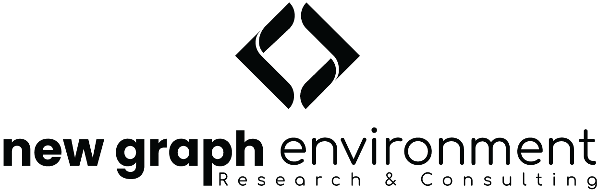

```{r jquery, echo=FALSE, eval=FALSE}
#see https://github.com/NewGraphEnvironment/mybookdown-template/issues/16
htmltools::tagList(rmarkdown::html_dependency_jquery())
```


```{r setup, echo=identical(params$gitbook_on, TRUE), include = TRUE}
knitr::opts_chunk$set(echo=identical(params$gitbook_on, TRUE), message=FALSE, warning=FALSE, dpi=60, out.width = "100%", fig.width = 8, fig.height = 6)
options(scipen=999)
options(knitr.kable.NA = '--')
options(knitr.kable.NAN = '--')
```


```{r source}
source('scripts/packages.R')
source('scripts/functions.R')
source('scripts/staticimports.R')
source('scripts/setup.R')
```

```{r settings-defaults}
# Defaults (overridden by settings-gitbook or settings-paged-html if they eval)
photo_width <- "100%"
font_set <- 11
```

```{r settings-gitbook, eval= params$gitbook_on}
photo_width <- "100%"
font_set <- 11

```

```{r settings-paged-html, eval= identical(params$gitbook_on, FALSE)}
photo_width <- "80%"
font_set <- 9
```


```{r include=FALSE}
# automatically create a bib database for R packages
knitr::write_bib(c(
  .packages(), 'bookdown', 'knitr', 'rmarkdown'
), 'packages.bib')
```

# Acknowledgement {.front-matter .unnumbered}

We understand our well-being as inseparable from the health of the land and waters we work within. When we care for ecosystems, we care for ourselves.

This work takes place within the Yintah of the Wet'suwet'en people, who have governed these lands and waters through their hereditary chief system for thousands of years. The Neexdzii Kwa (Upper Bulkley River) and its tributaries sustain salmon, steelhead, and the communities connected to them. 


```{js, logo-header, echo = FALSE, eval= T}
title=document.getElementById('header');
title.innerHTML = '<div style="text-align:center"></div>' + title.innerHTML
```

